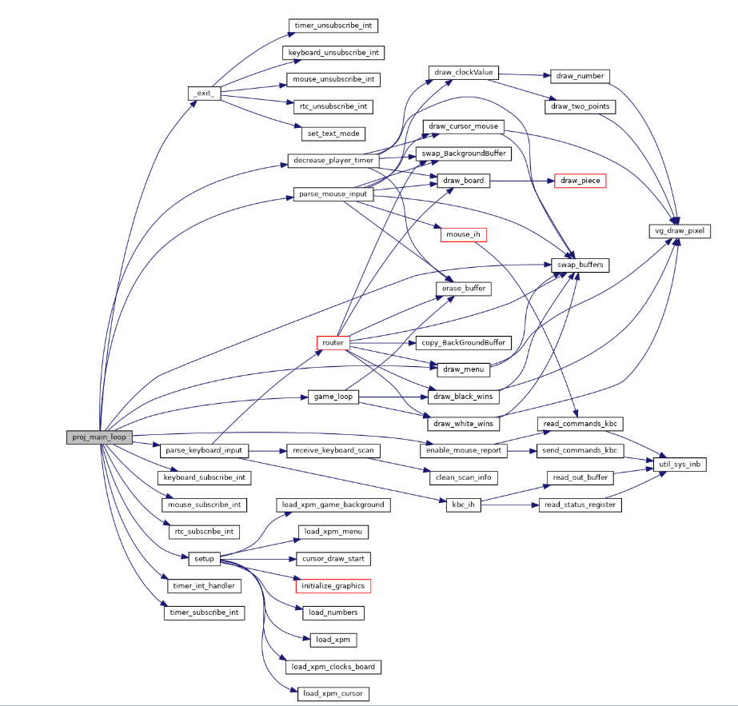

Neste projeto, desenvolvemos um jogo de xadrez que utiliza os drivers dos periféricos disponíveis nos computadores. O objetivo foi proporcionar uma compreensão prática de como os drivers podem permitir a comunicação entre periféricos e o computador. Essa experiência nos oferece insights valiosos sobre a integração e funcionamento dos dispositivos externos com o sistema computacional.

#### Com isto podemos ver como usamos a funções:

### Link do video de demonstração

[![Watch the video]](https://youtu.be/8OmHCuy_lGY)

### Autores:

* Angelo Rafael Araújo Oliveira (up202207798@up.pt)
* José Pedro Pereira da Costa(up202207871@up.pt)
* Bruno Miguel Ataide Fortes(up202209730@up.pt)
